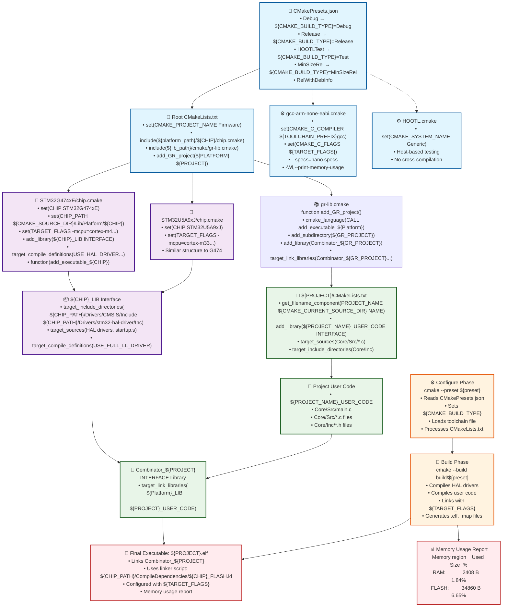

# CMake System Architecture Documentation

This document describes the CMake build system architecture for the Gaucho Racing Firmware repository. The system is designed to support multiple STM32 microcontroller platforms and different build configurations.

## Table of Contents

1. [Overview](#overview)
2. [Directory Structure](#directory-structure)
3. [System Architecture Diagram](#system-architecture-diagram)
4. [Core Components](#core-components)
5. [Build Process Flow](#build-process-flow)
6. [Adding New Platforms](#adding-new-platforms)
7. [Adding New Projects](#adding-new-projects)
8. [Build Configuration](#build-configuration)

## Overview

The CMake system is structured around a platform-agnostic architecture that allows easy addition of new STM32 microcontrollers and project configurations. Key features include:

- **Multi-platform support**: Easy switching between different STM32 families
- **Preset-based builds**: Pre-configured build types (Debug, Release, Test, etc.)
- **Modular design**: Platform libraries separate from user code
- **Cross-compilation**: ARM GCC toolchain integration
- **Testing support**: HOOTL (Hardware Out Of The Loop) testing capabilities

## Directory Structure

```
Firmware/
├── CMakeLists.txt              # Root build configuration
├── CMakePresets.json           # Build preset definitions
├── Lib/                        # Library components
│   ├── cmake/
│   │   ├── gcc-arm-none-eabi.cmake  # ARM toolchain configuration
│   │   └── gr-lib.cmake        # Gaucho Racing CMake utilities
│   └── Platform/               # Platform-specific configurations
│       ├── STM32G474xE/        # G474 platform files
│       │   └── chip.cmake      # G474 configuration & HAL drivers
│       └── STM32U5A9xJ/        # U5A9 platform files
│           └── chip.cmake      # U5A9 configuration & HAL drivers
├── cmake/
│   └── HOOTL.cmake            # Hardware-out-of-the-loop testing
├── G4BLINKY/                  # Example project directory
│   ├── CMakeLists.txt         # Project-specific build config
│   └── Core/                  # Project source code
└── [OTHER_PROJECTS]/          # Additional project directories
```

## System Architecture Diagram



### Extended System Architecture (ASCII Alternative)

```
╔═══════════════════════════════════════════════════════════════════════════════════════════════════════════╗
║                                      GAUCHO RACING CMAKE BUILD SYSTEM                                      ║
╠═══════════════════════════════════════════════════════════════════════════════════════════════════════════╣
║                                           CONFIGURATION LAYER                                              ║
╚═══════════════════════════════════════════════════════════════════════════════════════════════════════════╝

┌─────────────────────────┐    ┌───────────────────────────┐    ┌────────────────────────────────────────┐
│   CMakePresets.json     │    │    Root CMakeLists.txt    │    │           Toolchain Files              │
│                         │    │                           │    │                                        │
│ configurePresets:       │───▶│ Variables:                │───▶│ gcc-arm-none-eabi.cmake:              │
│ • Debug                 │    │ • ${CMAKE_PROJECT_NAME}   │    │ • set(CMAKE_C_COMPILER                 │
│   └→ ${CMAKE_BUILD_TYPE}│    │ • ${lib_path}="Lib"       │    │     ${TOOLCHAIN_PREFIX}gcc)            │
│      ="Debug"           │    │ • ${platform_path}=       │    │ • set(CMAKE_C_FLAGS                    │
│ • Release               │    │   "${lib_path}/Platform"  │    │     "${CMAKE_C_FLAGS} ${TARGET_FLAGS}")│
│ • HOOTLTest             │    │                           │    │ • --specs=nano.specs                  │
│   └→ ${CMAKE_BUILD_TYPE}│    │ Includes:                 │    │ • -Wl,--print-memory-usage            │
│      ="Test"            │    │ • include(${platform_path}│    │                                        │
│ • MinSizeRel            │    │   /${CHIP}/chip.cmake)    │    │ HOOTL.cmake:                           │
│ • RelWithDebInfo        │    │ • include(${lib_path}/    │    │ • set(CMAKE_SYSTEM_NAME Generic)       │
│                         │    │   cmake/gr-lib.cmake)     │    │ • Host-based testing                   │
│ buildPresets:           │    │                           │    │                                        │
│ • Corresponding builds  │    │ Commands:                 │    │                                        │
└─────────────────────────┘    │ • add_GR_project(         │    └────────────────────────────────────────┘
                               │   ${PLATFORM} ${PROJECT}) │
                               └───────────────────────────┘
                                           │
                                           ▼

╔══════════════════════════════════════════════════════════════════════════════════════════════════════════╗
║                                          LIBRARY CORE LAYER                                             ║
╚══════════════════════════════════════════════════════════════════════════════════════════════════════════╝

                               ┌───────────────────────────────────────────────────────────────────────────┐
                               │                           gr-lib.cmake                                   │
                               │                                                                           │
                               │ function(add_GR_project ${Platform} ${Project} [${Optional_Path}])              │
                               │ ┌─────────────────────────────────────────────────────────────────────┐   │
                               │ │ 1. cmake_language(CALL add_executable_${Platform} ${Project})      │   │
                               │ │ 2. add_subdirectory(${Project} or ${Optional_Path})                │   │
                               │ │ 3. add_library(Combinator_${Project} INTERFACE)                    │   │
                               │ │ 4. target_link_libraries(Combinator_${Project} INTERFACE           │   │
                               │ │      ${Platform}_LIB                                               │   │
                               │ │      ${Project}_USER_CODE)                                         │   │
                               │ │ 5. target_link_libraries(${Project} Combinator_${Project})         │   │
                               │ └─────────────────────────────────────────────────────────────────────┘   │
                               └───────────────────────────────────────────────────────────────────────────┘
                                           │
                                           ▼

╔══════════════════════════════════════════════════════════════════════════════════════════════════════════╗
║                                         PLATFORM LAYER                                                  ║
╚══════════════════════════════════════════════════════════════════════════════════════════════════════════╝

                                ┌──────────────────────────────────────┐
                                │        ${CHIP}/chip.cmake            │
                                │                                      │
                                │ Platform Variables:                  │
                                │ • ${CHIP} identifier                 │
                                │ • ${CHIP_PATH} directory             │
                                │ • ${TARGET_FLAGS} architecture       │
                                │                                      │
                                │ Library Creation:                    │
                                │ • ${CHIP}_LIB interface              │
                                │                                      │
                                │ Function:                            │
                                │ • add_executable_${CHIP}()           │
                                │   └→ Linker script configuration     │
                                └──────────────────────────────────────┘
                                                   │
                                                   ▼

              ┌─────────────────────────────────────────────────────────────────────────┐
              │                         ${CHIP}_LIB Interface                           │
              │                                                                         │
              │ Compile Definitions:                                                    │
              │ • HAL driver enable flags                                               │
              │ • Low-level driver enable flags                                         │
              │ • ${CHIP}-specific preprocessor defines                                 │
              │                                                                         │
              │ Include Directories:                                                    │
              │ • ${CHIP_PATH}/Drivers/CMSIS/Include                                    │
              │ • ${CHIP_PATH}/Drivers/stm32-hal-driver/Inc                             │
              │ • ${CHIP_PATH}/Drivers/CMSIS/Device/ST/${CHIP_FAMILY}/Include           │
              │                                                                         │
              │ Source Files:                                                           │
              │ • ${CHIP_PATH}/CompileDependencies/startup_*.s                          │
              │ • ${CHIP_PATH}/Drivers/stm32-hal-driver/Src/*_hal_*.c                   │
              │ • ${CHIP_PATH}/Drivers/stm32-hal-driver/Src/*_ll_*.c                    │
              └─────────────────────────────────────────────────────────────────────────┘
                                       │
                                       ▼

╔══════════════════════════════════════════════════════════════════════════════════════════════════════════╗
║                                         PROJECT LAYER                                                   ║
╚══════════════════════════════════════════════════════════════════════════════════════════════════════════╝

┌─────────────────────────────────────────────────────────────────────────────────────────────────────────┐
│                               ${PROJECT}/CMakeLists.txt Structure                                        │
│                              (Each project follows this pattern)                                         │
│                                                                                                           │
│ Project Name Extraction:                                                                                 │
│ • get_filename_component(${PROJECT_NAME} ${CMAKE_CURRENT_SOURCE_DIR} NAME)                              │
│                                                                                                           │
│ User Code Library Creation:                                                                              │
│ • add_library(${PROJECT_NAME}_USER_CODE INTERFACE)                                                      │
│                                                                                                           │
│ Source File Specification:                                                                               │
│ • target_sources(${PROJECT_NAME}_USER_CODE INTERFACE ...)                                               │
│   - Main application entry point                                                                         │
│   - Peripheral driver configurations                                                                     │
│   - Hardware abstraction layer customizations                                                            │
│   - Interrupt service routines                                                                           │
│   - System configuration files                                                                           │
│   - Memory management utilities                                                                          │
│                                                                                                           │
│ Include Directory Specification:                                                                         │
│ • target_include_directories(${PROJECT_NAME}_USER_CODE INTERFACE ...)                                   │
└─────────────────────────────────────────────────────────────────────────────────────────────────────────┘
                                       │
                                       ▼

              ┌─────────────────────────────────────────────────────────────────────────┐
              │                   ${PROJECT}/ Directory Structure                       │
              │                                                                         │
              │ Standard Layout:                                                        │
              │ • ${PROJECT}/ (project root)                                            │
              │   └── CMakeLists.txt (build configuration)                             │
              │   └── Core/                                                             │
              │       ├── Inc/ (Header files)                                          │
              │       │   ├── Main application headers                                 │
              │       │   ├── HAL configuration headers                                │
              │       │   ├── Interrupt handler headers                                │
              │       │   └── Peripheral driver headers                                │
              │       └── Src/ (Source files)                                          │
              │           ├── Main application source                                  │
              │           ├── Interrupt service routines                               │
              │           ├── HAL middleware support                                   │
              │           └── Peripheral driver implementations                        │
              └─────────────────────────────────────────────────────────────────────────┘
                                       │
                                       ▼

╔══════════════════════════════════════════════════════════════════════════════════════════════════════════╗
║                                        LINKING LAYER                                                    ║
╚══════════════════════════════════════════════════════════════════════════════════════════════════════════╝

              ┌─────────────────────────────────────────────────────────────────────────┐
              │                    Combinator_${PROJECT} Library                        │
              │                     (Interface Library)                                 │
              │                                                                         │
              │ Purpose: Links platform and project components together                 │
              │                                                                         │
              │ Dependencies:                                                           │
              │ • ${PLATFORM}_LIB (HAL + hardware abstraction)                         │
              │ • ${PROJECT}_USER_CODE (application-specific code)                     │
              │                                                                         │
              │ This creates the complete dependency chain:                             │
              │ Combinator_${PROJECT} → ${PLATFORM}_LIB + ${PROJECT}_USER_CODE         │
              └─────────────────────────────────────────────────────────────────────────┘
                                       │
                                       ▼

╔══════════════════════════════════════════════════════════════════════════════════════════════════════════╗
║                                        FINAL OUTPUT                                                     ║
╚══════════════════════════════════════════════════════════════════════════════════════════════════════════╝

              ┌─────────────────────────────────────────────────────────────────────────┐
              │                      Final ${PROJECT}.elf Executable                    │
              │                                                                         │
              │ Creation Process:                                                       │
              │ • add_executable(${PROJECT})                                            │
              │ • target_link_libraries(${PROJECT} Combinator_${PROJECT})              │
              │                                                                         │
              │ Configuration:                                                          │
              │ • LINK_FLAGS: "-T${CHIP_PATH}/CompileDependencies/${LINKER_SCRIPT}.ld" │
              │ • Compiler flags: ${TARGET_FLAGS}                                       │
              │ • Linker specifications: --specs=nano.specs                            │
              │ • Memory mapping: -Wl,-Map=${CMAKE_PROJECT_NAME}.map                   │
              │ • Memory reporting: -Wl,--print-memory-usage                           │
              │                                                                         │
              │ Output Files:                                                           │
              │ • ${PROJECT}.elf (executable binary)                                   │
              │ • ${CMAKE_PROJECT_NAME}.map (memory map)                               │
              └─────────────────────────────────────────────────────────────────────────┘

╔══════════════════════════════════════════════════════════════════════════════════════════════════════════╗
║                                     BUILD PROCESS FLOW                                                  ║
╚══════════════════════════════════════════════════════════════════════════════════════════════════════════╝

┌────────────────────────────┐                     ┌─────────────────────────────┐
│      Configure Phase       │                     │         Build Phase         │
│                            │────────────────────▶│                             │
│                            │                     │                             │
│ Process Overview:          │                     │ Compilation Steps:          │
│ 1. Read ${CMAKE_BUILD_TYPE}│                     │ 1. Compile HAL drivers      │
│ 2. Set build configuration │                     │    from ${CHIP}_LIB         │
│ 3. Load toolchain file     │                     │ 2. Compile user sources     │
│ 4. Process root build file │                     │    from ${PROJECT}_USER_CODE│
│ 5. Include chip config     │                     │ 3. Link with ${TARGET_FLAGS}│
│ 6. Include library utils   │                     │ 4. Apply linker script      │
│ 7. Call project function   │                     │ 5. Generate ${PROJECT}.elf  │
│ 8. Generate build files    │                     │ 6. Show memory usage        │
└────────────────────────────┘                     └─────────────────────────────┘
                                                               │
                                                               ▼
                                   ┌─────────────────────────────────────────────┐
                                   │           Memory Usage Report               │
                                   │                                             │
                                   │ Shows resource utilization:                 │
                                   │ • RAM usage vs available                    │
                                   │ • Flash memory usage vs available           │
                                   │ • Percentage utilization                    │
                                   │                                             │
                                   │ Generated Output Files:                     │
                                   │ • build/${preset}/${PROJECT}.elf           │
                                   │ • build/${preset}/${CMAKE_PROJECT_NAME}.map│
                                   └─────────────────────────────────────────────┘

╔══════════════════════════════════════════════════════════════════════════════════════════════════════════╗
║                                    AVAILABLE PROJECTS                                                   ║
╚══════════════════════════════════════════════════════════════════════════════════════════════════════════╝

Current Projects in Repository:
• G4BLINKY/     - Example STM32G474 blinky project
• G4MVP/        - STM32G474 MVP project
• DASHBLINKY/   - Dashboard blinky project  
• ACU/          - Accumulator Control Unit
• MVP/          - Main MVP project

To add a new project:
1. Create directory with CMakeLists.txt following the ${PROJECT_NAME}_USER_CODE pattern
2. Add add_GR_project(${PLATFORM} ${PROJECT_NAME}) to root CMakeLists.txt
```

## Core Components

### 1. Root CMakeLists.txt

The main build configuration file that:
- Sets up C11 standard and compiler settings
- Defines project name and build type defaults
- Includes platform and utility CMake files
- Calls `add_GR_project()` to create executables

### 2. CMakePresets.json

Defines build presets for different configurations:
- **Debug/Release/MinSizeRel**: ARM cross-compilation builds
- **HOOTLTest**: Host-based testing (Hardware Out Of The Loop)

### 3. Toolchain Files

#### gcc-arm-none-eabi.cmake
- Configures ARM GCC cross-compiler
- Sets CPU-specific flags via `TARGET_FLAGS`
- Configures linker settings (nano.specs, memory layout)
- Enables debug symbols and optimization levels

#### HOOTL.cmake
- Minimal toolchain for host-based testing
- Allows running tests on development machine

### 4. Platform Configuration (chip.cmake)

Each platform directory contains a `chip.cmake` file that:
- Defines chip-specific settings (`CHIP`, `CHIP_PATH`, `TARGET_FLAGS`)
- Creates a `PLATFORM_LIB` interface library
- Sets compile definitions (HAL drivers, chip-specific defines)
- Includes HAL driver source files and CMSIS headers
- Provides `add_executable_PLATFORM()` function

### 5. Gaucho Racing Library (gr-lib.cmake)

Provides the `add_GR_project()` function that:
1. Creates an executable using platform-specific function
2. Adds the project subdirectory
3. Creates a `Combinator_PROJECT` interface library
4. Links platform library and user code to the combinator
5. Links the combinator to the final executable

### 6. Project Structure

Each project (e.g., G4BLINKY) contains:
- `CMakeLists.txt`: Defines `PROJECT_USER_CODE` interface library
- `Core/Src/`: Source files (main.c, HAL configurations, etc.)
- `Core/Inc/`: Header files

## Build Process Flow

1. **Configuration Phase** (`cmake --preset <preset>`)
   - CMake reads `CMakePresets.json` 
   - Loads appropriate toolchain file
   - Processes root `CMakeLists.txt`
   - Includes platform `chip.cmake`
   - Includes utility `gr-lib.cmake`
   - Calls `add_GR_project(PLATFORM PROJECT)`

2. **Project Setup** (via `add_GR_project()`)
   - Calls `add_executable_PLATFORM(PROJECT)`
   - Processes project's `CMakeLists.txt`
   - Creates `PROJECT_USER_CODE` library
   - Creates `Combinator_PROJECT` library
   - Links everything together

3. **Build Phase** (`cmake --build`)
   - Compiles HAL drivers from platform library
   - Compiles user code from project library
   - Links using platform-specific linker script
   - Generates executable with memory usage report

## Adding New Platforms

To add a new STM32 platform (e.g., STM32H7):

1. **Create platform directory**:
   ```
   Lib/Platform/STM32H7xx/
   ├── chip.cmake
   ├── Drivers/
   │   ├── CMSIS/
   │   └── stm32h7xx-hal-driver/
   └── CompileDependencies/
       ├── startup_stm32h7xx.s
       └── STM32H7XX_FLASH.ld
   ```

2. **Configure chip.cmake**:
   ```cmake
   set(CHIP "STM32H7xx")
   set(TARGET_FLAGS "-mcpu=cortex-m7 -mfpu=fpv5-d16 -mfloat-abi=hard")
   # ... (similar to existing platforms)
   
   function(add_executable_STM32H7xx TARGET_NAME)
       add_executable(${TARGET_NAME})
       set_target_properties(${TARGET_NAME} PROPERTIES 
           LINK_FLAGS "-T${CHIP_PATH}/CompileDependencies/STM32H7XX_FLASH.ld")
   endfunction()
   ```

3. **Update root CMakeLists.txt**:
   ```cmake
   include(${platform_path}/STM32H7xx/chip.cmake)
   ```

## Adding New Projects

To create a new project:

1. **Create project directory** with `CMakeLists.txt`:
   ```cmake
   get_filename_component(PROJECT_NAME ${CMAKE_CURRENT_SOURCE_DIR} NAME)
   
   add_library(${PROJECT_NAME}_USER_CODE INTERFACE)
   target_sources(${PROJECT_NAME}_USER_CODE INTERFACE
       Core/Src/main.c
       # ... other source files
   )
   target_include_directories(${PROJECT_NAME}_USER_CODE INTERFACE
       Core/Inc
   )
   ```

2. **Update root CMakeLists.txt**:
   ```cmake
   add_GR_project(STM32G474xE MYPROJECT)
   ```

## Build Configuration

### Available Build Types

- **Debug**: `-O0 -g3` - Full debug symbols, no optimization
- **Release**: `-Os -g0 -Werror` - Size optimization, no debug, warnings as errors  
- **RelWithDebInfo**: Release optimization with debug symbols
- **MinSizeRel**: Minimal size release build
- **Test**: Host-based compilation for unit testing

### Common CMake Commands

```bash
# Configure for debug build
cmake --preset Debug

# Build the project  
cmake --build build/Debug

# Configure and build for release
cmake --preset Release
cmake --build build/Release

# Run tests
cmake --preset HOOTLTest
cmake --build build/HOOTLTest
```

### Memory Usage

The build system automatically displays memory usage after linking:
```
Memory region         Used Size  Region Size  %age Used
             RAM:        2408 B       128 KB      1.84%
           FLASH:       34860 B       512 KB      6.65%
```

This information helps ensure the firmware fits within the target microcontroller's constraints.
