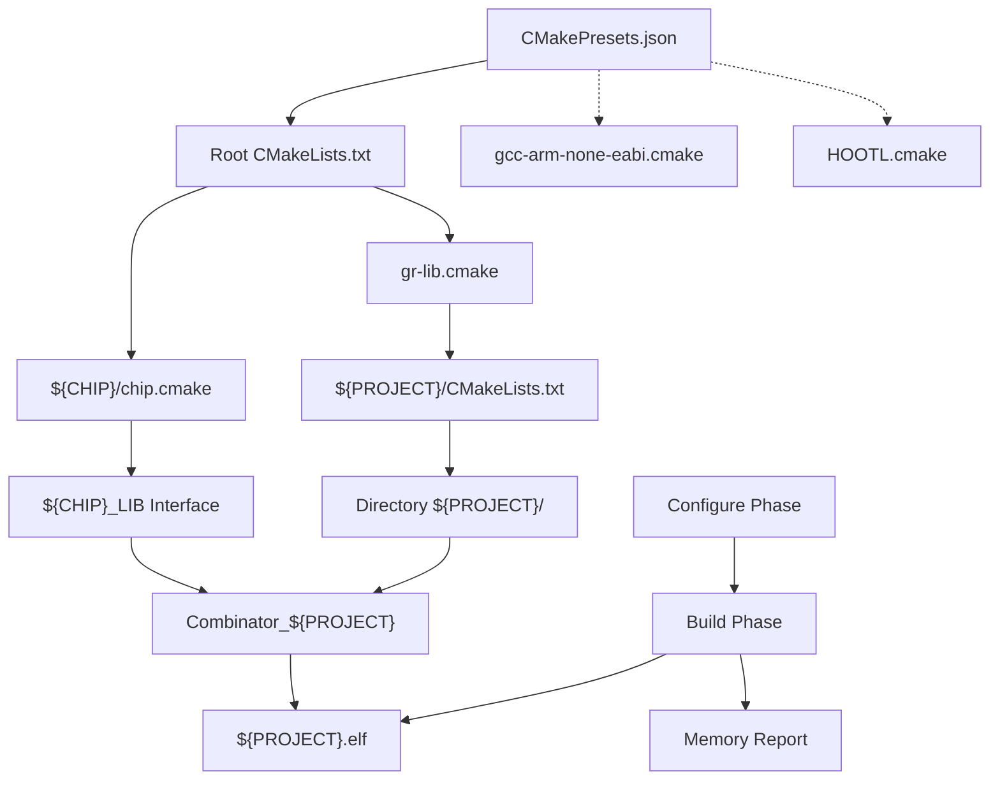

# CMake System Architecture Documentation

This document describes the CMake build system architecture for the Gaucho Racing Firmware repository. The system supports multiple STM32 microcontroller platforms and different build configurations. INTERFACE libraries should be preferred wherever possible.

## Makefile Overview

The top-level `Makefile` provides convenient targets for building, cleaning, and testing across all major CMake configurations:

- `all`: Builds all major configurations (`Debug`, `Release`, `RelWithDebInfo`, `MinSizeRel`, `HOOTLTest`).
- `Debug`, `Release`, `RelWithDebInfo`, `MinSizeRel`, `HOOTLTest`: Build the corresponding CMake preset.
- `clean`: Removes the `build` directory and all build artifacts.
- `sanitizer`: Runs tests with sanitizers enabled (host-based only).
- `valgrind`: Runs memory checks on host-based test executables.

To build all configurations and generate all necessary files for IDE support:

```sh
make all
```

To clean all build artifacts:

```sh
make clean
```

## Table of Contents

1. [Directory Structure](#directory-structure)
2. [System Architecture Diagram](#system-architecture-diagram)
3. [Core Components](#core-components)
4. [Build Process Flow](#build-process-flow)
5. [Compile Logical Flow](#compile-logical-flow)
6. [Adding New Platforms](#adding-new-platforms)
7. [Adding New Projects](#adding-new-projects)

## Directory Structure

```text
Firmware/
├── `CMakeLists.txt`                   # Root build configuration
├── `CMakePresets.json`                # Build preset definitions
├── `Lib`/                             # Library components
│   ├── `cmake`/
│   │   ├── `gcc-arm-none-eabi.cmake`  # ARM toolchain configuration
│   │   └── `gr-lib.cmake`             # CMake utilities
│   └── `Platform`/                    # Platform-specific configurations
│       ├── `STM32G474xE`/             # G474 platform files (`chip.cmake`)
│       ├── `STM32U5A9xJ`/             # U5A9 platform files (`chip.cmake`)
│       └── ...                        # Additional platforms
├── `cmake`/
│   └── `HOOTL.cmake`                  # Hardware-out-of-the-loop testing
├── [PROJECTS]/                        # Project directories (e.g., `ECU`, ...)
│   ├── `CMakeLists.txt`               # Project build config
│   └── `Core`/
│       ├── `Inc`/                     # Header files
│       └── `Src`/                     # Source files
└── ...
```

## System Architecture Diagram


```mermaid
flowchart TD
   %% Configuration Layer
   Presets["CMakePresets.json"] --> Root["Root CMakeLists.txt"]
   Presets -.-> Toolchain1["gcc-arm-none-eabi.cmake"]
   Presets -.-> Toolchain2["HOOTL.cmake"]

   %% Core Flow
   Root --> GRLib["gr-lib.cmake"]
   Root --> ChipConfig["${CHIP}/chip.cmake"]

   %% Platform & Project
   GRLib --> ProjectCMake["${PROJECT}/CMakeLists.txt"]
   ChipConfig --> PlatformLib["${CHIP}_LIB Interface"]

   %% Linking
   ProjectCMake --> UserCode["Directory ${PROJECT}/"]
   PlatformLib --> Combinator["Combinator_${PROJECT}"]
   UserCode --> Combinator

   %% Output
   Combinator --> Executable["${PROJECT}.elf"]

   %% Build Process
   Configure["Configure Phase"] --> Build["Build Phase"]
   Build --> Memory["Memory Report"]
   Build --> Executable
```

## Extended System Architecture

### Configuration Layer

- `CMakePresets.json`: Build and configure presets for cross-compilation and host testing.
- Toolchain files: `gcc-arm-none-eabi.cmake`, `HOOTL.cmake` for compiler, flags, and environment.
- Root `CMakeLists.txt`: Includes platform, utility, and project CMake files. Calls `add_GR_project()` for each project/platform.

### Library Core Layer

- `gr-lib.cmake`: Provides `add_GR_project()` to create platform-specific executables, add project subdirectories, create combinator interface libraries, and link dependencies.

### Platform Layer

- `${CHIP}/chip.cmake`: Defines chip variables, creates `${CHIP}_LIB` INTERFACE library, sets compile definitions, includes, and sources. Provides `add_executable_${CHIP}()`.

### Project Layer

- `${PROJECT}/CMakeLists.txt`: Extracts project name, creates `${PROJECT_NAME}_USER_CODE` INTERFACE library, uses `target_sources()` and `target_include_directories()` with INTERFACE scope.

### Linking Layer

- `Combinator_${PROJECT}` INTERFACE library: Links `${PLATFORM}_LIB` and `${PROJECT}_USER_CODE`.

### Output Layer

- Final executable: Created by linking the combinator library, using platform linker scripts and flags. Generates `.elf` and `.map` files, with memory usage reporting.

## Core Components

### Root `CMakeLists.txt`

- Sets up C11 standard and compiler settings
- Defines project name and build type defaults
- Includes platform and utility CMake files
- Calls `add_GR_project()` to create executables

### `CMakePresets.json`

- Build presets for different configurations:
  - Debug/Release/MinSizeRel: ARM cross-compilation builds
  - HOOTLTest: Host-based testing

### Toolchain Files

- `gcc-arm-none-eabi.cmake`: ARM GCC cross-compiler, CPU flags, linker settings, debug symbols, optimization
- `HOOTL.cmake`: Host-based toolchain for unit testing

### Platform Configuration (`chip.cmake`)

- Defines chip-specific settings (`CHIP`, `CHIP_PATH`, `TARGET_FLAGS`)
- Creates a `PLATFORM_LIB` INTERFACE library
- Sets compile definitions, includes, sources
- Provides `add_executable_PLATFORM()`

### Project Structure

- Each project (e.g., G4BLINKY) contains:
  - `CMakeLists.txt`: Defines `PROJECT_USER_CODE` INTERFACE library
  - `Core/Src/`: Source files (main.c, HAL configurations, etc.)
  - `Core/Inc/`: Header files

## Build Process Flow

1. **Configuration Phase** (`cmake --preset <preset>`)
   - CMake reads `CMakePresets.json`
   - Loads toolchain file
   - Processes root `CMakeLists.txt`
   - Includes platform `chip.cmake` and utility `gr-lib.cmake`
   - Calls `add_GR_project(PLATFORM PROJECT)`

2. **Project Setup**
   - Calls `add_executable_PLATFORM(PROJECT)`
   - Processes project's `CMakeLists.txt`
   - Creates `PROJECT_USER_CODE` INTERFACE library
   - Creates `Combinator_PROJECT` INTERFACE library
   - Links all components

3. **Build Phase** (`cmake --build`)
   - Compiles HAL drivers from platform library
   - Compiles user code from project library
   - Links using platform-specific linker script
   - Generates executable and memory usage report

## Compile Logical Flow

0. Root `CMakeLists.txt` includes all INTERFACE libraries and prepares other components
1. `add_executable_PLATFORM(PROJECT)` provides target flags, linker script, startup assembly, links CMSIS and HAL/LL libraries
2. `add_GR_project(PLATFORM PROJECT)` calls the former with the project and links global INTERFACE libraries
3. Each project then links any other global INTERFACE libraries it requires

## Adding New Platforms

Ensure that licenses are preserved!

1. Setup Vendor
   1. Copy CMSIS library from ST Microelectronics
   2. Copy HAL/LL libraries from ST Microelectronics
   3. Add CMake files to bundle as an INTERFACE as appropriate
2. Include new HAL/LL library INTERFACE into root `CMakeLists.txt`
3. Copy `Lib/Platform/PlatformTemplate` into `Lib/Platform/CHIP`
   1. Modify following instructions in the file
   2. Copy startup assembly script and linker script
   3. Write brief `README.md` in the form of the others
4. Include new platform in root `CMakeLists.txt`

## Adding New Projects

TODO... For now use STM32 CubeMX to configure peripherals and then copy `Core` code and follow pattern in other projects to compile. See the onboarding lecture on the monorepo for more information.
