# CMake System Architecture Documentation

This document describes the CMake build system architecture for the Gaucho Racing Firmware repository. The system is designed to support multiple STM32 microcontroller platforms and different build configurations.

## Table of Contents

1. [Overview](#overview)
2. [Directory Structure](#directory-structure)
3. [System Architecture Diagram](#system-architecture-diagram)
4. [Core Components](#core-components)
5. [Build Process Flow](#build-process-flow)
6. [Adding New Platforms](#adding-new-platforms)
7. [Adding New Projects](#adding-new-projects)
8. [Build Configuration](#build-configuration)

## Overview

The CMake system is structured around a platform-agnostic architecture that allows easy addition of new STM32 microcontrollers and project configurations. Key features include:

- **Multi-platform support**: Easy switching between different STM32 families
- **Preset-based builds**: Pre-configured build types (Debug, Release, Test, etc.)
- **Modular design**: Platform libraries separate from user code
- **Cross-compilation**: ARM GCC toolchain integration
- **Testing support**: HOOTL (Hardware Out Of The Loop) testing capabilities

## Directory Structure

```mermaid
flowchart TD
    Firmware["📁 Firmware/"]
    
    %% Root Files
    Firmware --> CMakeLists["📄 CMakeLists.txt<br/><small>Root build configuration</small>"]
    Firmware --> CMakePresets["📄 CMakePresets.json<br/><small>Build preset definitions</small>"]
    
    %% Lib Directory
    Firmware --> Lib["📁 Lib/<br/><small>Library components</small>"]
    Lib --> LibCmake["📁 cmake/"]
    LibCmake --> GccArm["📄 gcc-arm-none-eabi.cmake<br/><small>ARM toolchain configuration</small>"]
    LibCmake --> GrLib["📄 gr-lib.cmake<br/><small>Gaucho Racing CMake utilities</small>"]
    
    Lib --> Platform["📁 Platform/<br/><small>Platform-specific configurations</small>"]
    Platform --> STM32G474["📁 STM32G474xE/<br/><small>G474 platform files</small>"]
    STM32G474 --> ChipG4["📄 chip.cmake<br/><small>G474 configuration & HAL drivers</small>"]
    
    Platform --> STM32U5A9["📁 STM32U5A9xJ/<br/><small>U5A9 platform files</small>"]
    STM32U5A9 --> ChipU5["📄 chip.cmake<br/><small>U5A9 configuration & HAL drivers</small>"]
    
    Platform --> OtherPlatforms["📁 [OTHER_PLATFORMS]/<br/><small>Additional platform directories</small>"]
    OtherPlatforms --> OtherChip["📄 chip.cmake<br/><small>Platform-specific configurations</small>"]
    
    %% Cmake Directory
    Firmware --> CmakeDir["📁 cmake/"]
    CmakeDir --> HOOTL["📄 HOOTL.cmake<br/><small>Hardware-out-of-the-loop testing</small>"]
    
    %% Project Directories
    Firmware --> G4BLINKY["📁 G4BLINKY/<br/><small>Example project directory</small>"]
    G4BLINKY --> G4CMake["📄 CMakeLists.txt<br/><small>Project-specific build config</small>"]
    G4BLINKY --> G4Core["📁 Core/<br/><small>Project source code</small>"]
    
    Firmware --> OtherProjects["📁 [OTHER_PROJECTS]/<br/><small>Additional project directories</small>"]
    OtherProjects --> OtherCMake["📄 CMakeLists.txt<br/><small>Project build configurations</small>"]
    OtherProjects --> OtherCore["📁 Core/<br/><small>Project source files</small>"]
    
    %% Styling
    classDef rootFile fill:#e3f2fd,stroke:#1976d2,stroke-width:2px,color:#000000
    classDef libFile fill:#f3e5f5,stroke:#7b1fa2,stroke-width:2px,color:#000000
    classDef projectFile fill:#e8f5e8,stroke:#388e3c,stroke-width:2px,color:#000000
    classDef folder fill:#fff8e1,stroke:#f57c00,stroke-width:1px,color:#000000
    
    class CMakeLists,CMakePresets rootFile
    class GccArm,GrLib,ChipG4,ChipU5,OtherChip,HOOTL libFile
    class G4CMake,OtherCMake projectFile
    class Firmware,Lib,LibCmake,Platform,STM32G474,STM32U5A9,OtherPlatforms,CmakeDir,G4BLINKY,G4Core,OtherProjects,OtherCore folder
```



## System Architecture Diagram

```mermaid
flowchart TD
    %% Configuration Layer
    Presets["CMakePresets.json<br/><br/>configurePresets:<br/>• Debug → Debug build<br/>• Release → Release build<br/>• HOOTLTest → Test build<br/>• MinSizeRel → Min size<br/>• RelWithDebInfo<br/><br/>buildPresets:<br/>• Matching build configs"]
    
    Root["Root CMakeLists.txt<br/><br/>Variables:<br/>• PROJECT_NAME=Firmware<br/>• lib_path=Lib<br/>• platform_path=Lib/Platform<br/><br/>Includes:<br/>• chip.cmake<br/>• gr-lib.cmake<br/><br/>Commands:<br/>• add_GR_project()"]
    
    Toolchain1["gcc-arm-none-eabi.cmake<br/><br/>ARM Cross-Compilation:<br/>• Sets C compiler<br/>• Configures C flags<br/>• --specs=nano.specs<br/>• Memory usage reporting<br/>• Debug & optimization"]
    
    Toolchain2["HOOTL.cmake<br/><br/>Host-Based Testing:<br/>• Generic system<br/>• No cross-compilation<br/>• Development machine<br/>• Unit testing support"]
    
    %% Core Library Layer
    GRLib["gr-lib.cmake<br/><br/>add_GR_project function:<br/>1. Call add_executable_Platform<br/>2. Add project subdirectory<br/>3. Create Combinator library<br/>4. Link Platform & User libs<br/>5. Link to final executable"]
    
    %% Platform Layer
    ChipConfig["chip.cmake<br/><br/>Platform Variables:<br/>• CHIP identifier<br/>• CHIP_PATH directory<br/>• TARGET_FLAGS<br/><br/>Library Creation:<br/>• CHIP_LIB interface<br/><br/>Function:<br/>• add_executable_CHIP()"]
    
    PlatformLib["CHIP_LIB Interface<br/><br/>Compile Definitions:<br/>• HAL driver flags<br/>• LL driver flags<br/>• Chip-specific defines<br/><br/>Include Directories:<br/>• CMSIS headers<br/>• HAL driver headers<br/><br/>Source Files:<br/>• Startup assembly<br/>• HAL driver sources"]
    
    %% Project Layer
    ProjectCMake["Project CMakeLists.txt<br/><br/>Name Extraction:<br/>• get_filename_component<br/><br/>User Code Library:<br/>• PROJECT_USER_CODE<br/><br/>Source Files:<br/>• Main application<br/>• Peripheral configs<br/>• HAL customizations<br/>• Interrupt handlers<br/><br/>Include Directories:<br/>• Core/Inc"]
    
    UserCode["Project Directory<br/><br/>Standard Layout:<br/>• PROJECT/ root<br/>• CMakeLists.txt<br/>• Core/Inc/ headers<br/>• Core/Src/ sources<br/><br/>File Types:<br/>• Application code<br/>• System config<br/>• Hardware drivers<br/>• ISR implementations"]
    
    %% Linking Layer
    Combinator["Combinator Library<br/><br/>INTERFACE Library<br/><br/>Purpose:<br/>Links platform &<br/>project components<br/><br/>Dependencies:<br/>• PLATFORM_LIB<br/>• PROJECT_USER_CODE<br/><br/>Creates complete<br/>dependency chain"]
    
    %% Final Output
    Executable["Final Executable<br/><br/>Creation Process:<br/>• add_executable()<br/>• Link combinator<br/><br/>Configuration:<br/>• Linker script<br/>• Compiler flags<br/>• Memory mapping<br/><br/>Output Files:<br/>• PROJECT.elf<br/>• Memory map"]
    
    %% Build Process
    Configure["Configure Phase<br/><br/>cmake --preset<br/><br/>Process:<br/>1. Read presets<br/>2. Set build config<br/>3. Load toolchain<br/>4. Process CMakeLists<br/>5. Include configs<br/>6. Generate build files"]
    
    Build["Build Phase<br/><br/>cmake --build<br/><br/>Compilation:<br/>1. Compile HAL drivers<br/>2. Compile user code<br/>3. Link with flags<br/>4. Apply linker script<br/>5. Generate executable<br/>6. Memory report"]
    
    %% Memory Output
    Memory["Memory Usage Report<br/><br/>Resource Utilization:<br/>• RAM vs available<br/>• Flash vs available<br/>• Percentage usage<br/><br/>Output Files:<br/>• build/preset/PROJECT.elf<br/>• build/preset/PROJECT.map"]
    
    %% Available Projects
    Projects["Available Projects<br/><br/>Current Projects:<br/>• G4BLINKY<br/>• G4MVP<br/>• DASHBLINKY<br/>• ACU<br/>• MVP<br/><br/>To Add New Project:<br/>1. Create CMakeLists.txt<br/>2. Follow USER_CODE pattern<br/>3. Add to root CMakeLists"]
    
    %% Connections
    Presets --> Root
    Presets -.-> Toolchain1
    Presets -.-> Toolchain2
    Root --> GRLib
    Root --> ChipConfig
    
    GRLib --> ProjectCMake
    ChipConfig --> PlatformLib
    
    ProjectCMake --> UserCode
    PlatformLib --> Combinator
    UserCode --> Combinator
    
    Combinator --> Executable
    
    Configure --> Build
    Build --> Memory
    Build --> Executable
    
    Root -.-> Projects
    
    %% Styling
    classDef config fill:#e3f2fd,stroke:#1976d2,stroke-width:2px,color:#000000
    classDef platform fill:#f3e5f5,stroke:#7b1fa2,stroke-width:2px,color:#000000
    classDef project fill:#e8f5e8,stroke:#388e3c,stroke-width:2px,color:#000000
    classDef build fill:#fff8e1,stroke:#f57c00,stroke-width:2px,color:#000000
    classDef output fill:#fce4ec,stroke:#c2185b,stroke-width:2px,color:#000000
    
    class Presets,Root,Toolchain1,Toolchain2 config
    class ChipConfig,PlatformLib platform
    class ProjectCMake,UserCode,Combinator,Projects project
    class Configure,Build build
    class Executable,Memory output
```



## Core Components

### 1. Root CMakeLists.txt

The main build configuration file that:
- Sets up C11 standard and compiler settings
- Defines project name and build type defaults
- Includes platform and utility CMake files
- Calls `add_GR_project()` to create executables

### 2. CMakePresets.json

Defines build presets for different configurations:
- **Debug/Release/MinSizeRel**: ARM cross-compilation builds
- **HOOTLTest**: Host-based testing (Hardware Out Of The Loop)

### 3. Toolchain Files

#### gcc-arm-none-eabi.cmake
- Configures ARM GCC cross-compiler
- Sets CPU-specific flags via `TARGET_FLAGS`
- Configures linker settings (nano.specs, memory layout)
- Enables debug symbols and optimization levels

#### HOOTL.cmake
- Minimal toolchain for host-based testing
- Allows running tests on development machine

### 4. Platform Configuration (chip.cmake)

Each platform directory contains a `chip.cmake` file that:
- Defines chip-specific settings (`CHIP`, `CHIP_PATH`, `TARGET_FLAGS`)
- Creates a `PLATFORM_LIB` interface library
- Sets compile definitions (HAL drivers, chip-specific defines)
- Includes HAL driver source files and CMSIS headers
- Provides `add_executable_PLATFORM()` function

### 5. Gaucho Racing Library (gr-lib.cmake)

Provides the `add_GR_project()` function that:
1. Creates an executable using platform-specific function
2. Adds the project subdirectory
3. Creates a `Combinator_PROJECT` interface library
4. Links platform library and user code to the combinator
5. Links the combinator to the final executable

### 6. Project Structure

Each project (e.g., G4BLINKY) contains:
- `CMakeLists.txt`: Defines `PROJECT_USER_CODE` interface library
- `Core/Src/`: Source files (main.c, HAL configurations, etc.)
- `Core/Inc/`: Header files

## Build Process Flow

1. **Configuration Phase** (`cmake --preset <preset>`)
   - CMake reads `CMakePresets.json` 
   - Loads appropriate toolchain file
   - Processes root `CMakeLists.txt`
   - Includes platform `chip.cmake`
   - Includes utility `gr-lib.cmake`
   - Calls `add_GR_project(PLATFORM PROJECT)`

2. **Project Setup** (via `add_GR_project()`)
   - Calls `add_executable_PLATFORM(PROJECT)`
   - Processes project's `CMakeLists.txt`
   - Creates `PROJECT_USER_CODE` library
   - Creates `Combinator_PROJECT` library
   - Links everything together

3. **Build Phase** (`cmake --build`)
   - Compiles HAL drivers from platform library
   - Compiles user code from project library
   - Links using platform-specific linker script
   - Generates executable with memory usage report

## Adding New Platforms

TODO

## Adding New Projects

To create a new project for any supported platform:

TODO

## Build Configuration

### Available Build Types

- **Debug**: `-O0 -g3` - Full debug symbols, no optimization
- **Release**: `-Os -g0 -Werror` - Size optimization, no debug, warnings as errors  
- **RelWithDebInfo**: Release optimization with debug symbols
- **MinSizeRel**: Minimal size release build
- **Test**: Host-based compilation for unit testing

### Common CMake Commands

```bash
# Configure for debug build
cmake --preset Debug

# Build the project  
cmake --build build/Debug

# Configure and build for release
cmake --preset Release
cmake --build build/Release

# Run tests
cmake --preset HOOTLTest
cmake --build build/HOOTLTest
```

### Memory Usage

The build system automatically displays memory usage after linking, such as:
```
Memory region         Used Size  Region Size  %age Used
             RAM:        2408 B       128 KB      1.84%
           FLASH:       34860 B       512 KB      6.65%
```

This information helps ensure the firmware fits within the target microcontroller's constraints.
