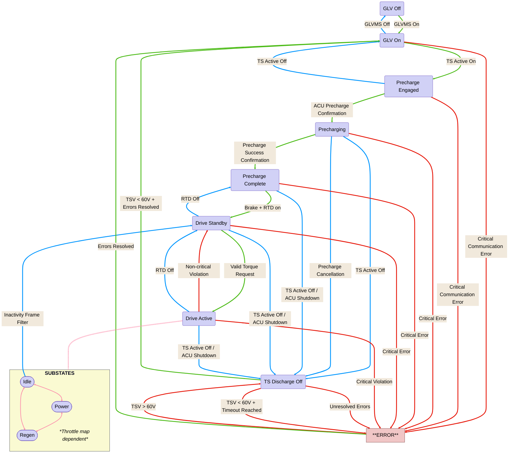

# ECU State Machine Diagram for GR26

## Key
- **Green:** Standard start up
- **Blue:** Shutdown without critical errors
- **Red:** Critical error handling
- **Pink:** Between drive active substates

