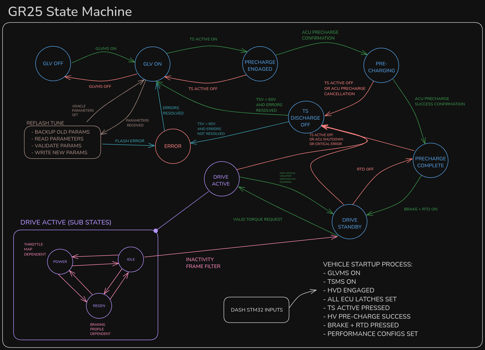

# ECU (Engine Control Unit)

Vehicle state management and safety systems for the GR26 electric race car.

## Overview

The ECU firmware manages:
- **Vehicle state machine** - Controls operational states (Init → Ready → Driving → Error)
- **CAN communication** - Primary communication hub for all vehicle systems
- **Safety systems** - Monitors critical parameters and implements fail-safes
- **Sensor interfaces** - Reads and processes sensor data

## Hardware
- **Target**: STM32G474RE microcontroller
- **Memory**: 512KB Flash, 128KB RAM
- **Communication**: CAN bus, SWO debug output
- **Debug**: ST-Link with OpenOCD support

## Quick Start

1. **Build**: `cmake --preset=debug && cmake --build --preset=debug --target ECU`
2. **Debug**: Use VS Code "Debug ECU" configuration
3. **Monitor**: SWO output provides real-time state and CAN message logging

## State Machine

The ECU implements a hierarchical state machine managing vehicle operational states with safety transitions.

## Key Files

- **`Application/Src/state_machine.c`** - Main vehicle state logic
- **`Application/Src/can_handler.c`** - CAN message processing  
- **`Application/Src/safety.c`** - Safety monitoring and fault handling
- **`Application/Src/sensors/`** - Individual sensor drivers

## Documentation

For complete build, debug, and development instructions, see:

- **[BUILD.md](../BUILD.md)** - Build system and compilation
- **[DEBUGGING.md](../DEBUGGING.md)** - Debug setup and techniques  
- **[EXTENDING.md](../EXTENDING.md)** - Adding features and modifications

## CAN Communication

The ECU acts as the primary CAN node, broadcasting vehicle status and receiving commands from dashboard and steering panels. All CAN message IDs are defined in `lib/CSVGenerator/CAN_IDs.csv`.

## Development

Use the modern CMake build system with incremental builds and VS Code integration. The ECU supports comprehensive debugging via ST-Link with SWO real-time output for non-intrusive monitoring.
