# State Machine Diagram

This diagram governs the state of the car and represents the logical overview of processes on the car. This diagram must reflect the actual car operations and will help to confirm rules compliance.

If changes are made to the state machine, either in diagram or in implementation, then that PR with the change must update both representations.

The state machine runs on the ECU, but it maps to an enum which may be transmitted over CAN. Again, changes to implementation must be reflected in the diagram and vice-versa.

```mermaid
%%{init: {
  'theme': 'base',
  'themeVariables': {
    'primaryColor': '#ff6b6b',
    'primaryTextColor': '#1f2328',
    'lineColor': '#808080',
    'edgeLabelBackground': 'rgba(255,255,255,0.8)',
    'transitionLabelColor': '#1f2328',
    'secondaryColor': '#4ecdc4',
    'tertiaryColor': '#ffe66d',
    'background': 'transparent',
    'mainBkg': 'transparent',
    'secondBkg': 'transparent',
    'tertiaryBkg': 'transparent'
  },
  'themeCSS': '.transition { stroke: #808080; } marker path { fill: #808080; stroke: #808080; } .node rect, .node circle, .node ellipse, .node polygon, .node path { stroke: #808080; stroke-width: 0; }'
}}%%

stateDiagram

    [*] --> GLV_Off

    %% Main horizontal flow (top row)
    GLV_Off --> GLV_On : GLVMS On
    GLV_On --> GLV_Off : GLVMS Off
    GLV_On --> Precharge_Engaged : TS Active
    Precharge_Engaged --> Precharge_Complete : Precharge OK
    Precharge_Complete --> Drive_Active : Brake & RTD

    %% Normal Operation Cycle (horizontal)
    Drive_Active --> Precharge_Complete : RTD

    %% Discharge state positioned below
    GLV_Off
    GLV_On
    Precharge_Engaged
    Precharge_Complete
    Drive_Active
    Tractive_System_Discharge

    %% Downward transitions to discharge
    Precharge_Engaged --> Tractive_System_Discharge : TS Active OR Comm Error
    Precharge_Complete --> Tractive_System_Discharge : TS Active OR Critical Error
    Drive_Active --> Tractive_System_Discharge : TS Active OR Critical Error

    %% Return upward from discharge
    Tractive_System_Discharge --> GLV_On : TS Voltage < 60V

    %% State Descriptions
    GLV_Off : GLV Off
    GLV_On : GLV On
    Precharge_Engaged : Precharge Engaged
    Precharge_Complete : Precharge Complete
    Drive_Active : Drive Active
    Tractive_System_Discharge : Tractive System Discharge

    classDef safeState fill:#4ecdc4,stroke:#ffffff,stroke-width:1px,color:#000
    classDef hvState fill:#ff6b6b,stroke:#ffffff,stroke-width:1px,color:#fff
    classDef transitionState fill:#ffe66d,stroke:#ffffff,stroke-width:1px,color:#000
    classDef dischargeState fill:#ff9500,stroke:#ffffff,stroke-width:1px,color:#000

    class GLV_Off,GLV_On safeState
    class Drive_Active hvState
    class Precharge_Engaged,Precharge_Complete transitionState
    class Tractive_System_Discharge dischargeState
```

- 🟦 **Blue**: Low voltage
- 🟥 **Red**: HV charged
- 🟨 **Yellow**: HV precharge
- 🟧 **Orange**: HV discharge
