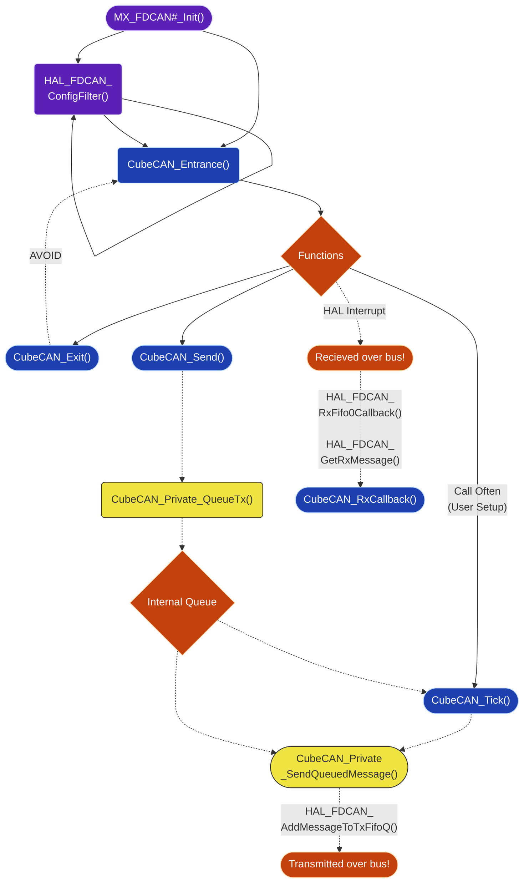

# Cube CAN

Support for STM32CubeMX and CAN. See [`CUBEMX.md`](../../../CUBEMX.md) for background.

## Summary

Use STM32CubeMX to setup the CAN peripheral, then call `CubeCAN_Entrance()` on it after HAL initializes the peripheral.

Save the handle that function returns and use that to send messages. Receive messages on your function callback.

> [!IMPORTANT]
> We recommend that your received message callback function is a switch-case off of the message ID that does nothing more than writing to memory.
>
> Your `CubeCAN_RxCallback()` function must run quickly, it is inside of a low level ISR.
> Read the library code yourself if you wish to call a CubeCAN function from within an ISR, but you really should not.

## Setup

### 1. CMake

Add `CUBEMX_CAN_LIB` as an interface target link library within your project.

### 2. Configuration

Add a file named `CubeCAN_Config.h` to your project, generally `Application/Inc/CubeCAN_Config.h`, that looks something like:

```c
#ifndef CUBE_CAN_CONFIG_H
#define CUBE_CAN_CONFIG_H

#define CUBEMX_CAN_TX_QUEUE_SIZE 16U
#define CUBEMX_CAN_MAX_INSTANCES 1U

#endif
```

**Configuration Requirements:**

- `CUBEMX_CAN_TX_QUEUE_SIZE`: Must be a power of two. Defines the transmission queue depth; when the queue fills, the oldest message is dropped and `CubeCAN_Send()` returns `HAL_BUSY`.
- `CUBEMX_CAN_MAX_INSTANCES`: Must be 1-3 depending on your chip's available FDCAN peripherals. Omit this definition to automatically select the maximum supported by your MCU.

From there just ensure that you have configured CAN through STM32CubeMX and setup a global variable for each `CubeCAN_Handle` you wish to use.

### 3. Entrance

Make sure to `#include "CubeCAN.h"` where needed. Do not include `PrivateInc/internal.h` outside of the peripheral source files.

At the end of your STM32CubeMX-generated `MX_FDCAN#_Init()` function, configure your filters as needed with `HAL_FDCAN_ConfigFilter()`. It is recommended to setup a filter to ignore messages not intended for your board.

Within `main` after `MX_FDCAN#_Init()` and `LOGOMATIC()` are setup (see [Logomatic](../../Utils/Logomatic/README.md)), call `CubeCAN_Entrance()` saving the handle for global use later (one entrance and handle per peripheral).

Ensure you have setup some mechanism to call `CubeCAN_Tick()` frequently (a STM32CubeMX timer interrupt is recommended). This function:

- Sends one CAN message per bus per call (limiting to one prevents overwhelming the ISR)
- Must be called regularly for messages to be transmitted
- Can start running at any point in execution

### 4. Operation

#### Transmission

Call `CubeCAN_Send()` to queue a message for transmission. Messages are queued in a lock-free ring buffer and processed in FIFO order.

- **Returns `HAL_OK`**: Message successfully queued
- **Returns `HAL_BUSY`**: Transmission queue is full; the oldest queued message was dropped to make room for the new one
- **Returns `HAL_ERROR`**: Invalid parameters (null handle/data, size > 64 bytes, invalid frame format)

Each call to `CubeCAN_Tick()` transmits one message from the queue per peripheral. If you need higher throughput, call `CubeCAN_Tick()` more frequently or increase `CUBEMX_CAN_TX_QUEUE_SIZE`.

#### Reception

Your provided callback `CubeCAN_RxCallback()` is triggered for messages that pass your configured filters.

- Keep execution time minimal, you are in a hardware ISR
- Avoid calling CubeCAN functions or performing blocking operations
- Typical pattern is to decode the message and write results to shared memory (protected with atomic operations or critical sections as needed)

## Architecture



## Advanced

### Interrupt Safety

CubeCAN is designed to handle concurrent access from multiple execution contexts (main loop and ISR).

#### Overview

- `tx_head` and `tx_tail` are atomic `uint32_t` variables that implement a lock-free ring buffer
- `CubeCAN_Send()` and `CubeCAN_Tick()` use critical sections (interrupt blocking) when necessary
- Atomic operations use `memory_order_relaxed` within ISRs and `memory_order_release`/`memory_order_acquire` for inter-context synchronization
- The queue size must be a power of two, allowing fast wraparound via bitwise AND instead of expensive modulo operations

#### Critical Sections

Interrupt protection is used only in:

- `CubeCAN_Private_QueueTx()` while updating the queue
- `HAL_FDCAN_RxFifo0Callback` while reading handle state

#### ISR Interaction

- Safe to call `CubeCAN_Send()` from `main()` or any ISR
- Safe to call `CubeCAN_Tick()` from `main()` or any ISR
- Do not call any CubeCAN function from `CubeCAN_RxCallback()`, use it only to write data to shared memory (with concurrency safety as needed)

### Filters

You are responsible for configuring CAN filters.

Use `HAL_FDCAN_ConfigFilter()` in `MX_FDCAN#_Init()` to setup any filters you need. Configure the number and type of filters in STM32CubeMX.

#### Best Practices

Create a filter to accept only messages intended for your board

The library uses only `HAL_FDCAN_RxFifo0Callback()` for message reception, you can define your own `HAL_FDCAN_RxFifo1Callback()` for additional needs

#### Message Overflow

If your received message FIFO overflows (messages arrive faster than they're processed), the library logs a warning and drops the oldest messages.

Improve this by increasing callback efficiency or adding more CAN filters to reduce unwanted messages.

### Rx Callback Context

You may consolidate multiple receive callbacks into a single function by passing different context data to each handle.

Use the context union for this, it can point to arbitrary data or to a bus ID. It is your responsibility to be consistent the peripheral will just return input.

### Tx Message Marker

Currently we do not do anything cool with this, but we could!

If you would like to see this do something please open an Issue (and if you want to code it, a Pull Request as well)

### Assertions

We currently provide compile time static assertions to validate:

- Memory alignment of 32 bits for `tx_head` and `tx_tail`
- Struct alignment of >=4 bytes for `GRCAN_Private_TxMessage` and `CubeCAN_Private_Handle`
- Union compatibility for types `GRCAN_BUS_ID` and `void*`
- Lock free atomic operations for integers and booleans guaranteed by the compiler
- `CUBEMX_CAN_TX_QUEUE_SIZE` is a power of two and non-zero (allows faster ring-buffer wrapping)
- `CUBEMX_CAN_MAX_INSTANCES` requires management of 1 to 3 interfaces (optional parameter, otherwise automatically chooses the maximum possible)

### Globals

CubeCAN maintains a global private array of handles (sized to `CUBEMX_CAN_MAX_INSTANCES`).

- Each handle is 28 bytes (overhead)
- Plus transmission queue: `CUBEMX_CAN_TX_QUEUE_SIZE` times `sizeof(GRCAN_Private_TxMessage)` (4 byte header and 64 bytes of data, at print time)

If your chip supports multiple FDCAN peripherals but you need fewer, set `CUBEMX_CAN_MAX_INSTANCES` lower to avoid wasting memory on unused handles. Similarly, reduce `CUBEMX_CAN_TX_QUEUE_SIZE` if you send infrequently and have frequent ticks.

## Troubleshooting

TODO

As issues are found we will extend this section. For now, please contact the Firmware Manager if you are unable to get this working.
