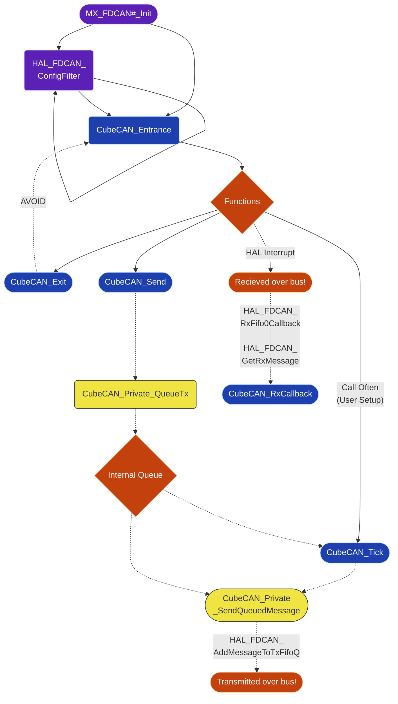

# Cube CAN

Support for STM32CubeMX and CAN. See [`CUBEMX.md`](../../../CUBEMX.md) for background.

## Overview

Use STM32CubeMX to setup the CAN peripheral, then call `CubeCAN_Entrance` on it after HAL initializes the peripheral.
Save the handle that function returns and use that to send messages. Recieve messages on your function callback.

> [!IMPORTANT]
> It is recommended to have your Rx callback function primarily be a switch case off of the message ID.
>
> Your `CubeCAN_RxCallback` function must run quickly, it is inside of a low level ISR.

## Setup

### 1. CMake

Add `CUBEMX_CAN_LIB` as an interface target link library within your project.

### 2. Configuration

Add a file named `CubeCAN_Config.h` to your project (generally `Application/Inc/CubeCAN_Config.h`) that has the following symbols defined

```c
#ifndef CUBE_CAN_CONFIG_H
#define CUBE_CAN_CONFIG_H

#define CUBEMX_CAN_TX_QUEUE_SIZE 16U
#define CUBEMX_CAN_MAX_INSTANCES 1U

#endif
```

Note that `CUBEMX_CAN_TX_QUEUE_SIZE` must be a multiple of two and `CUBEMX_CAN_MAX_INSTANCES` must be valid for that chip.

From there just ensure that you have configured CAN through STM32CubeMX and setup a global variable for each `CubeCAN_Handle` you wish to use.

### 3. Entrance

Make sure to `#include "CubeCAN.h"` where needed. Do not include `PrivateInc\internal.h` outside of the peripheral source files.

At the end of your STM32CubeMX-generated `MX_FDCAN#_Init` function configure your filters as needed with `HAL_FDCAN_ConfigFilter`

Within `main` after `MX_FDCAN#_Init` and `LOGOMATIC` are setup (see [Logomatic](../../Utils/Logomatic/README.md)) call `CubeCAN_Entrance` saving the handle for global use later (one entrance and handle per peripheral)

Double check you have setup some manner to call `CubeCAN_Tick` often (a STM32CubeMX timer is recommended), it can start running at any point in execution

### 4. Transmission / Reception

If you are frequently calling `CubeCAN_Tick` then as you call `CubeCAN_Send` messages will be transmitted once per bus per tick

Your provided callback `CubeCAN_RxCallback` will be triggered with messages that pass any filters you setup

## Architecture



## Advanced

### Rx Callback Context

You may find it helpful to have just one Rx callback function instead of one per handle

You can do this by providing the same `CubeCAN_RxCallback` function pointer for each handle and specifying a `CubeCAN_Config_Context` per handle.

`CubeCAN_Config_Context` supports both `GRCAN_BUS_ID` and arbitrary void pointers thanks to a unioned field which is type checked at compile time

Note that it is your responsibility to use either the void pointers or `GRCAN_BUS_ID` values, the peripheral treats this as a magic
32-bit value, the union is provided for your convenience for common cases (recieving messages from both a subnet and the proper bus
OR recieving messages from multiple buses)

### Tx Message Marker

TODO

Currently we do not do anything cool with this, but we could!

### Assertions

We currently provide compile time static assertions to validate:

- Memory alignment of 32 bits for `tx_head` and `tx_tail`
- Struct alignment of >=4 bytes for `GRCAN_Private_TxMessage` and `CubeCAN_Private_Handle`
- Union compatibility for types `GRCAN_BUS_ID` and `void*`
- Lock free atomic operations for integers and booleans guaranteed by the compiler
- `CUBEMX_CAN_TX_QUEUE_SIZE` is a power of two and non-zero (allows faster ring-buffer wrapping)
- `CUBEMX_CAN_MAX_INSTANCES` requires management of 1 to 3 interfaces (optional parameter, otherwise automatically chooses the maximum possible)

### Globals

We store a global private array of CubeCAN handles (sized to `CUBEMX_CAN_MAX_INSTANCES`)

Main point of allowing user provided `CUBEMX_CAN_MAX_INSTANCES` values is that each handle is 28 bytes not including the queue size,
but if you add a large queue on a chip that supports three CANFD peripherals and only need one peripherals that is a lot of wasted memory.
